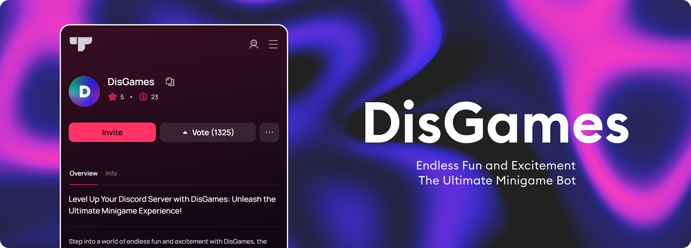

# DisGames - Interactive Discord Gaming Bot

[](https://discord.gg/beKZbQ9vxe)
[](https://www.typescriptlang.org/)
[](https://nodejs.org/)
[](https://www.mysql.com/)

**DisGames is a Discord bot that turns any server into a game night**: word puzzles, logic challenges, trivia, and more, all playable right in chat, with leaderboards, profile cards, and badges to keep players coming back.

It's a solo project, built and maintained from the ground up: every game, every command, the API that powers the dashboard, and the pipeline that keeps it all running. This README covers what it does for players, and further down, how it's built for anyone curious about the engineering side.

[**Join the support Discord**](https://discord.gg/beKZbQ9vxe) to try it out or ask questions.

## Features

Eight game types, played right in chat, with interactive buttons, real-time scoring, and multi-language support:
- Word games with scrambled puzzles and word chains
- Logic challenges including pattern recognition, number guessing, and flag/country identification
- Trivia and connections-style community games
- Progressive difficulty and per-server customization

Beyond the games themselves: live leaderboards, profile cards and badges, a premium tier, and per-channel configuration, all backed by a dashboard with its own API.

## Under the hood

This is the part that made DisGames genuinely hard to build, and worth being proud of. Eight games, real-time scoring, a REST API, a dashboard, and background jobs all had to share one codebase without turning into a mess. So it's organized like a production system, not a script: business logic (games, points, badges), Discord integration, and infrastructure (database, jobs, API) each live in their own layer and only talk to each other through clean boundaries. That's what makes it possible to add a ninth game or swap the database without rewriting everything around it.

**By the numbers:** ~290 TypeScript files, ~25,000 lines of code, 8 games, 50+ tests, all written and maintained solo.

<details>
<summary><strong>Full folder structure</strong> (click to expand)</summary>

```
src/
├── commands/            # Command definitions
├── events/              # Event handlers (messages, interactions)
├── buttons/             # Persistent (long-lived) button handlers
├── builders/            # UI component builders
│   ├── buttons/         # Button components
│   ├── cards/           # Canvas-based image cards (profile, badge, leaderboard)
│   ├── containers/      # Message container builders
│   ├── embeds/          # Rich embed builders
│   ├── modals/          # Modal builders
│   └── selectmenus/     # Select menu components
├── services/
│   ├── application/     # Application layer (Components, Media, Charts, WebSocket, Jobs)
│   ├── domain/          # Domain layer (Game, User, Server, Points, Badges business logic)
│   ├── discord/         # Discord integration layer (Events, Handlers, Mappers)
│   ├── games/           # Game implementations (Anagram, Connections, Counting, etc.)
│   └── events/          # Domain event definitions
├── repositories/        # Data access layer with BaseRepository pattern
├── db/                  # Stored procedures/routines synced to the database
├── controllers/         # API controllers (Dashboard, Timeline, User, TypeGenerator)
├── middleware/          # Express middleware (API keys, request context)
├── jobs/                # Scheduled background tasks
├── interfaces/          # TypeScript types (application, domain, database, enums, view)
└── utils/               # Utilities and helpers
    ├── api/             # API type generation and exceptions
    ├── application/     # Application utilities (Config, Error, Logger)
    ├── collectors/      # Automatic discovery (Commands, Endpoints, Interfaces)
    ├── constants/       # Constants (Colors, Emojis)
    ├── database/        # Database utilities and validators
    ├── handlers/        # Event and command handlers
    ├── helpers/         # Helper functions (Duration, Embed, Enum, etc.)
    ├── routines/        # Database routine/procedure sync
    └── i18n/            # Internationalization system
```

</details>

### Built with

- **TypeScript** (strict mode) with auto-generated types and API wrappers for every endpoint
- **Discord.js v14**, **MySQL2** with connection pooling, and a repository pattern for data access
- **Express** and **WebSocket** powering the dashboard's REST API and real-time updates
- **Canvas** for the dynamic profile, badge, and leaderboard images
- **node-schedule** for background jobs, and a custom test framework covering unit, integration, and performance tests
- API key authentication, OAuth-based dashboard identity, and request context isolation for security

## Getting Started

See [INSTALL.md](INSTALL.md) for setup instructions, including a Docker option that bundles the app and database into a single container.

## License

This project is licensed under the MIT License - see the [LICENSE](LICENSE) file for details.

## Support & Contact

- **Discord Support Server**: [Join Here](https://discord.gg/beKZbQ9vxe)
- **Issues**: [GitHub Issues](https://github.com/MielVelden/DisGames/issues)

---

<p align="center">
  <strong>If you find this project useful, please consider giving it a star.</strong>
</p>

<p align="center">
  Designed, built, and maintained solo by <a href="https://github.com/MielVelden">Miel</a>
</p>